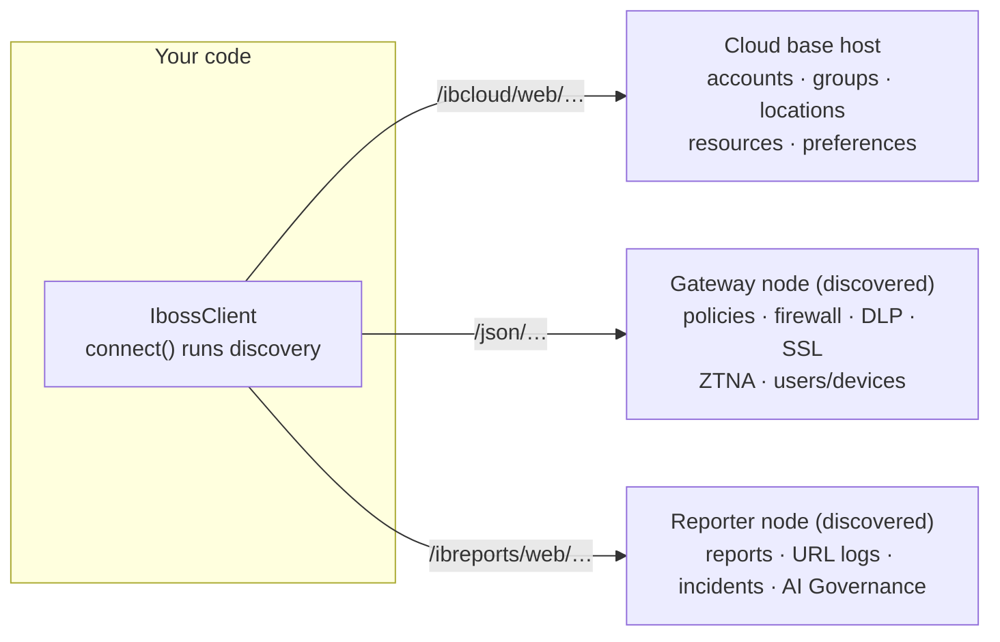

<p align="center">
  <picture>
    <source media="(prefers-color-scheme: dark)" srcset="docs/assets/iboss-logo-white.png">
    
  </picture>
</p>

<h1 align="center">iboss API SDK</h1>

<p align="center">
  Build integrations and automation workflows on the <strong>iboss Zero Trust SSE platform</strong>.<br>
  A typed API client, a workflow framework, a CLI, and an optional web UI in a single repository.
</p>

<p align="center">
  <code>TypeScript</code> ·
  <code>API-key auth</code> ·
  <code>Node ≥ 18.14</code> ·
  <code>no build step</code>
</p>

---

## Table of contents

- [Why this SDK](#why-this-sdk)
- [Quick start](#quick-start)
- [How it works](#how-it-works)
- [The three modes](#the-three-modes)
  - [1. Library](#1-library)
  - [2. CLI](#2-cli)
  - [3. Web UI (optional)](#3-web-ui-optional)
- [Workflows](#workflows)
- [Building with AI](#building-with-ai)
- [Error handling](#error-handling)
- [Security](#security)
- [Repository layout](#repository-layout)
- [Development](#development)
- [Documentation index](#documentation-index)

## Why this SDK

The iboss platform is fully API-driven: everything you can configure in the
admin console, you can automate. This SDK is a working foundation for that
automation, so you start from a connected, tested client and go straight to
the logic you care about. A few examples of what teams build with it:

- push a domain to a blocklist or allowlist across every account you manage,
  from one command
- onboard a new account with your standard policy set: layers, locations,
  connector settings, DLP rules
- audit API-key expiry, policy coverage, or SSL decryption settings on a
  schedule and report the results
- export URL event logs and top-N reports into your SIEM or data warehouse
- manage proxy users and devices from your own provisioning system
- give operations a self-service page of one-click automations through the
  web UI

Authentication, per-account node discovery, session management, retries, and
the platform's request conventions are already implemented and verified, so a
new automation is one small file rather than a project. What you get:

| Benefit | What it means |
|---|---|
| Single-step auth | Your API key is the bearer token. Set `credentials: { apiKey }` and connect. Rotation and expiry tracking are built in. |
| Automatic host discovery | `connect()` maps your account's gateway, reporter, and browser-isolation nodes. Nothing is hardcoded. |
| Typed client, 13 feature areas | `client.policies`, `.dlp`, `.ssl`, `.network`, `.locations`, `.reporting`, `.governance`, and more, plus a `raw()` escape hatch for anything else. |
| Platform conventions built in | Two-step policy creation, XSRF handling per host, verified wire shapes, and retry with backoff are part of the library and documented in `docs/api/`. |
| Write once, run anywhere | A workflow file is both a CLI command and a web UI card, backed by one engine. |
| AI-ready documentation | `AGENTS.md`, skills, and per-endpoint docs let Claude Code, Cursor, and other AI tools build workflows from a plain-language description. |
| Multi-account support | An API key belongs to exactly one account, so a profile holds one key per account. Fleet runs iterate them with an isolated session per account, and failures are collected instead of stopping the run. |
| Credential safety | Config files are gitignored, keys are stored with owner-only permissions, logs are redacted, and a secret scanner runs in `npm test`. |

## Quick start

Clone the repo, then paste this block into your terminal as-is:

```sh
cd iboss-api-sdk
npm install
npx iboss init
```

`npx iboss init` is a guided setup: it asks for your cloud domain and your
API key (input hidden, one key per account, stored outside the repo with
owner-only permissions), verifies each key against the platform, and prints
what to run next. Requires Node 18.14 or later; TypeScript runs directly,
so there is no build step.

Then try it out (also paste-safe):

```sh
npx iboss auth test
npx iboss run hello-account
npx iboss run block-domains --input domains=bad.example.com,worse.example.com
```

`auth test` verifies the key and shows the account, discovered hosts, and
key expiry; `hello-account` is the smallest shipped workflow; the
`block-domains` line adds two example domains to a blocklist policy layer.
For scripted setup (`iboss accounts add`), env-based credentials, and named
multi-account profiles, see [docs/GETTING_STARTED.md](docs/GETTING_STARTED.md).

## How it works

The SDK models the platform's topology and routes every call to the right
host with the right session state:



Authentication uses the API key as the bearer token. Every request carries
`Authorization: Token <apiKey>`. There is no login exchange and no token
refresh. `connect()` then:

1. validates the key and lists the accounts it can manage (the primary
   account is selected by default)
2. resolves the API user and the key's expiry date
3. walks the account's clusters to discover the gateway, reporter, and
   browser-isolation hostnames
4. establishes per-host sessions (cookies and XSRF tokens) for the calls
   that follow

One request layer handles headers, per-host cookie jars, XSRF selection,
`accountSettingsId` injection, retries with backoff, and typed error mapping.
Full detail: [docs/ARCHITECTURE.md](docs/ARCHITECTURE.md).

## The three modes

The three modes are independent. The library and CLI never require the UI.

### 1. Library

Import the client into your own scripts, services, or AI agents:

```ts
import { IbossClient } from "@iboss/sdk";

const client = new IbossClient({
  domain: process.env.IBOSS_CLOUD_DOMAIN!,
  credentials: { apiKey: process.env.IBOSS_API_KEY! },
});

await client.connect();

// Typed feature areas
const layers = await client.policies.listLayers();
const groups = await client.groups.listFilteringGroups();
const zones  = await client.locations.listPacZones();

// Two-step policy creation wrapped in one call:
const layer = await client.policies.createLayer({
  name: "Global Blocklist",
  type: "blocklist",
  settings: { policyAction: 0 },        // block
});
await client.policies.addLayerUrl(layer.customCategoryId, "blocked.example.com");

// Escape hatch for endpoints without a wrapper (still gets auth, cookies, XSRF, retries):
const raw = await client.raw("gateway", "GET", "/json/controls/confidenceScores");
```

Feature areas: `account`, `groups`, `policies`, `resources`, `locations`,
`network`, `dlp`, `ssl`, `firewall`, `apps`, `directory`, `reporting`.
Endpoint-level docs for each area: [docs/api/](docs/api/README.md). Runnable
scripts: [examples/](examples/).

### 2. CLI

Everything is scriptable from the terminal, whether by hand, from cron or CI,
or by an AI agent:

```sh
npx iboss auth test                        # verify credentials, show session
npx iboss auth rotate-key                  # rotate the API key (asks for confirmation)
npx iboss accounts list                    # accounts configured in the profile (--verify to connect each)
npx iboss accounts add emea                # add an account's API key (prompted, input hidden)
npx iboss accounts remove emea             # remove an account's key from the profile
npx iboss workflows list                   # discovered workflows
npx iboss run <workflow> --input k=v       # run a workflow (--input is repeatable)
npx iboss run <workflow> --input-json @in.json
npx iboss run block-domains-fleet --input domains=bad.example.com   # across ALL accounts in the profile
npx iboss api GET /ibcloud/web/users/mySettings    # raw API escape hatch
```

Global options on every command:

| Option | Purpose |
|---|---|
| `--profile <name>` | select a named profile from `iboss.config.json` or `~/.iboss/config.json` |
| `--account <id>` | pin a specific accountSettingsId |
| `--json` | machine-readable output for scripts and agents |
| `--domain` / `--api-key` | one-off credential overrides |

### 3. Web UI (optional)

A localhost app for teams that prefer a browser:

```sh
npm run ui        # http://127.0.0.1:5173
```

- workflow cards discovered from `workflows/`
- input forms generated from each workflow's schema, with no UI code to write
- live run output with cancel; results shown as JSON
- a Settings page for named API-key profiles, with a test-connection button

Keys are stored in `~/.iboss/config.json` with owner-only permissions, never
in this repository. The UI does not display stored keys (only the last four
characters) and the server binds to localhost.

## Workflows

A workflow is one TypeScript file in [`workflows/`](workflows/). Adding the
file makes it a CLI command and a UI card. No registration step, no build:

```ts
// workflows/allow-partner-domains/index.ts
import { defineWorkflow } from "@iboss/sdk";
import { z } from "zod";

export default defineWorkflow({
  name: "allow-partner-domains",
  description: "Add partner domains to an allowlist policy layer.",
  inputs: z.object({
    domains: z.array(z.string().min(1)).min(1).describe("Domains to allow"),
    layerName: z.string().default("Partner Allowlist").describe("Target layer"),
    dryRun: z.boolean().default(false).describe("Preview without applying"),
  }),
  async run(ctx, input) {
    const layers = await ctx.client.policies.listLayers();
    let layer = layers.find((l) => l.customCategoryName === input.layerName);

    if (!layer && !input.dryRun) {
      ctx.progress("create-layer", "start");
      const created = await ctx.client.policies.createLayer({
        name: input.layerName,
        type: "allowlist",
        settings: { policyAction: 1 },
      });
      layer = { ...created, customCategoryName: input.layerName };
      ctx.progress("create-layer", "done");
    }

    for (const domain of input.domains) {
      if (ctx.signal.aborted) break;                    // clean Ctrl-C / UI cancel
      if (input.dryRun) { ctx.log(`would allow ${domain}`); continue; }
      await ctx.client.policies.addLayerUrl(layer!.customCategoryId, domain);
      ctx.log(`+ ${domain}`);
    }
    return { layer: input.layerName, count: input.domains.length, dryRun: input.dryRun };
  },
});
```

```sh
npx iboss run allow-partner-domains --input domains=a.example.com,b.example.com --input dryRun=true
```

The zod `inputs` schema is the single source of truth. It validates input,
coerces CLI flags such as `--input dryRun=true`, and generates the UI form.
Text passed to `.describe()` becomes labels and help text.

### Multi-account example: block a domain on every account

An API key belongs to exactly one account, so a multi-account profile lists
one key per account. Add keys without editing any file:

```sh
npx iboss accounts add hq --domain api.ibosscloud.com    # prompts for each key
npx iboss accounts add emea    # each NEW name adds an account; repeating a name updates its key
```

which produces:

```jsonc
// iboss.config.json
{
  "profiles": {
    "fleet": {
      "domain": "api.ibosscloud.com",
      "accounts": [
        { "name": "hq",   "apiKey": "<key for the HQ account>" },
        { "name": "emea", "apiKey": "<key for the EMEA account>" }
      ]
    }
  }
}
```

Set `multiAccount: true` and wrap the work in `ctx.forEachAccount`. Each
account runs with its own key and an isolated session, and one failing
account does not stop the rest:

```ts
// workflows/block-domains-fleet/index.ts (ships with the SDK)
export default defineWorkflow({
  name: "block-domains-fleet",
  description: "Add domains to a blocklist policy layer on every account in the profile.",
  multiAccount: true,
  inputs: z.object({
    domains: z.array(z.string().min(1)).min(1).describe("Domains to block"),
    layerName: z.string().default("SDK Blocklist").describe("Target layer"),
  }),
  async run(ctx, input) {
    const results = await ctx.forEachAccount(async (sub) => {
      // Find or create the blocklist layer on THIS account
      const layers = await sub.client.policies.listLayers();
      let layerId = layers.find((l) => l.customCategoryName === input.layerName)?.customCategoryId;
      if (layerId === undefined) {
        const created = await sub.client.policies.createLayer({
          name: input.layerName,
          type: "blocklist",
          settings: { policyAction: 0 },
        });
        layerId = created.customCategoryId;
      }

      // Add only the domains that are not already on it
      const existing = new Set((await sub.client.policies.getLayerUrls(layerId)).map((u) => u.url));
      let added = 0;
      for (const domain of input.domains) {
        if (existing.has(domain)) continue;
        await sub.client.policies.addLayerUrl(layerId, domain);
        added++;
      }
      return { layerId, added };
    });
    // Map<accountSettingsId, result | Error>
    return Object.fromEntries(results);
  },
});
```

Run it from the CLI:

```sh
npx iboss run block-domains-fleet --input domains=bad.example.com,worse.example.com
```

```
▶ block-domains-fleet — account: hq
  … account:hq
  [hq] + bad.example.com
  [hq] + worse.example.com
  ✔ account:hq
  … account:emea
  [emea] created layer "SDK Blocklist" (id 1091)
  [emea] + bad.example.com
  [emea] + worse.example.com
  ✔ account:emea
✔ block-domains-fleet finished
{
  "hq":   { "layerId": 1127, "added": 2 },
  "emea": { "layerId": 1091, "added": 2 }
}
```

The same workflow appears in the web UI as a card labeled `multi-account`;
the run page notes that it applies to every account in the profile. For the
plain-library version of this pattern, see
[examples/06-block-domain-across-accounts.ts](examples/06-block-domain-across-accounts.ts).

Full authoring reference: [docs/WORKFLOWS.md](docs/WORKFLOWS.md).

## Building with AI

This repository is set up to be opened in Claude Code, Cursor, or another AI
editor and driven by plain language, for example:

> "Create a workflow that adds a list of domains to the allowlist across all
> of our accounts."

The AI has what it needs to do that correctly:

- [`AGENTS.md`](AGENTS.md): repo conventions and the standard path for building workflows (`CLAUDE.md` imports it for Claude tools)
- [`.claude/skills/`](.claude/skills/): step-by-step recipes (`create-workflow`, `iboss-api-reference`, `add-api-client`, `create-skill`)
- [`docs/api/*.md`](docs/api/README.md): endpoint tables that include the platform's non-obvious behaviors
- shipped workflows in [`workflows/`](workflows/) as worked examples

The result lands in `workflows/`, is verified with `npx iboss workflows
list`, and runs from the CLI or UI.

You can also teach the AI your own procedures: the `create-skill` skill
packages a runbook (an onboarding checklist, a quarterly review, incident
response steps) as a new skill file in this repo, so the next person who
opens it can run your process by describing it.

### Using with your own agents

The AI enablement is not tied to one editor:

- **Claude Code / Claude Agent SDK.** Open or mount this repo and the skills,
  `AGENTS.md`, and docs load automatically. This is the richest experience.
- **Cursor and other AI editors.** These do not read `.claude/skills/`, but
  the skills are thin routers by design: the substance lives in `AGENTS.md`
  (the cross-tool instructions standard, which Cursor reads natively) and
  `docs/`, so the
  same conventions and API knowledge are available.
- **Your own agent loop** (any framework). Two proven patterns:
  1. *CLI as the tool surface.* Give the agent shell access to the repo and
     have it call `npx iboss ... --json` (every command has machine-readable
     output). Workflow discovery, runs, and the raw API escape hatch are one
     command away.
  2. *Library as the tool surface.* Import `IbossClient`, `runWorkflow`, and
     `discoverWorkflows` from `@iboss/sdk` and expose them as tools in your
     framework. Inject [`docs/api/README.md`](docs/api/README.md) plus the
     relevant feature-area doc into the agent's context; the docs are written
     agent-first for exactly this.

## Error handling

Failures map to typed errors so code can branch on error class instead of
message strings:

| Error | HTTP | Meaning |
|---|---|---|
| `IbossAuthError` | 401 | key missing, expired, revoked, or wrong cloud domain |
| `IbossXsrfError` | 403 | per-host session state; rarely a permissions issue |
| `IbossSubscriptionError` | 422 | account lacks the module (DLP, ZTNA, etc.); check `account.subscriptionFlags` |
| `IbossHostUnavailableError` | n/a | the account has no node of that type (e.g. no reporting cluster) |
| `IbossNetworkError` | n/a | transport failure after retries |

Retries are automatic (exponential backoff with jitter; POST retries
transport errors only). Set `IBOSS_DEBUG=1` for request-level logging with
credentials redacted. Details:
[docs/api/errors-and-gotchas.md](docs/api/errors-and-gotchas.md).

## Security

- Keys never live in the repository. `.env` and `iboss.config.json` are
  gitignored; `~/.iboss/config.json` is written with owner-only permissions.
- A secret scanner runs in the test gate. `npm test` fails on leaked
  credentials or tenant identifiers (`npm run check:secrets`).
- Logging is redacted everywhere: tokens, cookies, and keys are masked.
- Key rotation is one command (`npx iboss auth rotate-key`) and expiry is
  reported at connect time.
- The UI binds to localhost, stores keys write-only, and masks display.
- Sessions are isolated per account, with separate cookie jars.

## Repository layout

```
├── packages/sdk/          the SDK: client, feature APIs, workflow engine, CLI
│   ├── src/client/        auth, discovery, request layer, cookies, errors
│   ├── src/api/           13 feature-area sub-clients
│   ├── src/workflows/     defineWorkflow, discovery, runner
│   ├── src/cli/           the `iboss` command
│   └── test/              tests incl. a mock iboss (3 host tiers, XSRF enforced)
├── apps/ui/               optional web UI (Vite + React + Hono); nothing depends on it
├── workflows/             your workflows live here (auto-discovered)
├── docs/                  getting started, architecture, workflows, api reference
├── examples/              small runnable library scripts
└── .claude/skills/        AI-editor recipes
```

## Development

```sh
npm test              # secret scan + unit/integration tests (in-process mock iboss)
npm run typecheck     # strict TypeScript across all packages
npm run ui            # web UI dev server
```

The mock server (`packages/sdk/test/mock-server/`) simulates all three host
tiers with real cookie issuance and XSRF enforcement, so client logic is
tested without touching a live tenant. To wrap a new endpoint, follow
[.claude/skills/add-api-client/SKILL.md](.claude/skills/add-api-client/SKILL.md).

## Documentation index

| Doc | Contents |
|---|---|
| [docs/GETTING_STARTED.md](docs/GETTING_STARTED.md) | setup, credentials, profiles, first calls |
| [docs/ARCHITECTURE.md](docs/ARCHITECTURE.md) | host tiers, auth and discovery, cookies/XSRF, retries |
| [docs/WORKFLOWS.md](docs/WORKFLOWS.md) | full workflow authoring reference |
| [docs/api/README.md](docs/api/README.md) | endpoint reference index (13 feature areas) |
| [docs/api/errors-and-gotchas.md](docs/api/errors-and-gotchas.md) | status semantics, host routing, platform behaviors |
| [workflows/README.md](workflows/README.md) | quick workflow authoring guide |

Requirements: Node.js 18.14 or later, and an iboss Zero Trust SSE account
(platform v10.1 or later) with an API key.

## License

MIT
